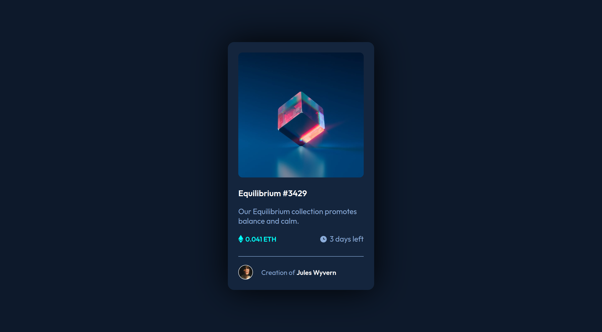
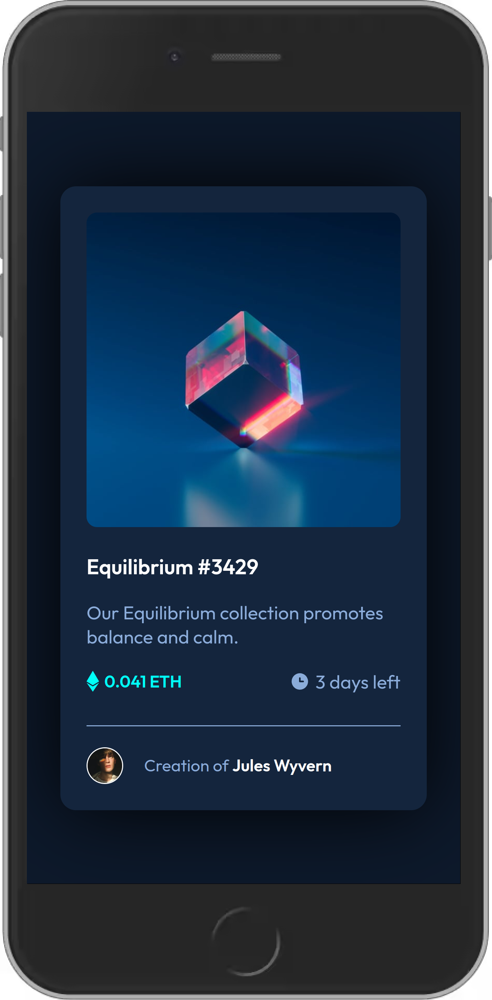

# nft-previev-card-component---frontend-mentor

Simple NFT Preview Card Component from Frontend Mentor

# Frontend Mentor - NFT Preview Card component solution

This is a solution to the [NFT preview card challenge on Frontend Mentor](https://www.frontendmentor.io/challenges/interactive-rating-component-koxpeBUmI).

## Table of contents

- [Links](#https://hombreombre.github.io/interactive-rating-component---Frontend-Mentor/)
- [My process](#my-process)
- [Built with](#HTML & CSS)
- [Author](#HombreOmbre)

### The challenge

Users should be able to:

- View the optimal layout depending on their device's screen size
- See hover states for interactive elements

### Screenshot

### Links

- Solution URL: [https://hombreombre.github.io/interactive-rating-component---Frontend-Mentor/]

### Built with

- Semantic HTML5 markup
- CSS custom properties
- Flexbox

## Author

- Frontend Mentor - [@HombreOmbre](https://www.frontendmentor.io/profile/HombreOmbre)
